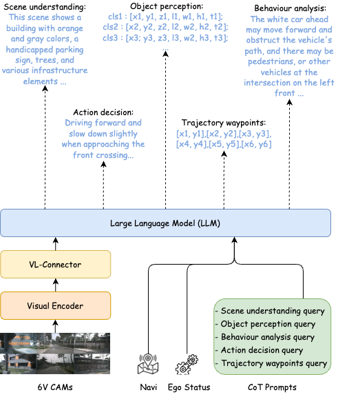

# VLArena: Integrating End-to-End Multimodal Models with Closed-loop Generative Simulation for Autonomous Driving

## Abstract 📄

VLArena integrates the End-to-End Multimodal Model for Autonomous Driving (EMMA) with the DriveArena simulation platform to advance autonomous driving research. By combining EMMA's capability to process raw sensor data into driving-specific outputs with DriveArena's high-fidelity, closed-loop simulation environment, VLArena enables the development and evaluation of autonomous driving agents in realistic and interactive scenarios. Additionally, this project has open-sourced a Chain-of-Thought (CoT) data auto-labeling pipeline tool, streamlining the annotation process for complex datasets. This integration facilitates comprehensive testing and refinement of autonomous driving models, promoting safer and more efficient autonomous vehicle technologies.

## Table of Contents 📚

- [VLArena: Integrating End-to-End Multimodal Models with Closed-loop Generative Simulation for Autonomous Driving](#vlarena-integrating-end-to-end-multimodal-models-with-closed-loop-generative-simulation-for-autonomous-driving)
  - [Abstract 📄](#abstract-)
  - [Table of Contents 📚](#table-of-contents-)
  - [Demo and Key Results 🎯](#demo-and-key-results-)
  - [VLArena Overview 🏎️](#vlarena-overview-️)
  - [Auto-Labeling Pipeline 🔖](#auto-labeling-pipeline-)
  - [VLM for Autonomous Driving 🚗](#vlm-for-autonomous-driving-)
  - [DriveArena Platform 🛠️](#drivearena-platform-️)
  - [Acknowledgement 🙏](#acknowledgement-)

## Demo and Key Results 🎯

| Model             | L2(m)1s   | L2(m)2s   | L2(m)3s   | Avg L2(m) |
| ----------------- | --------- | --------- | --------- | --------- |
| UniAD             | 0.42      | 0.64      | 0.91      | 0.66      |
| VAD               | 0.17      | 0.34      | 0.60      | 0.37      |
| OmniDrive         | 0.14      | 0.29      | 0.55      | 0.33      |
| DriveVLM          | 0.18      | 0.34      | 0.68      | 0.40      |
| EMMA(random init) | 0.15      | 0.33      | 0.63      | 0.37      |
| Ours              | **0.14** | **0.30** | **0.57** | **0.34** |

## VLArena Overview 🏎️

VLArena is the first closed-loop simulation system designed specifically for Vision-Language Models (VLMs). The system consists of three key components: the traffic manager, a video generative model, and a VLM-based driving model. The traffic manager controls the flow of surrounding vehicles and updates map information based on the driving agent's decisions. The system uses relative context such as HD maps, road layouts, and the ego vehicle’s status as inputs to the generative model, which produces future panoramic views around the ego vehicle. These generated views are then passed to the VLM model, which predicts future driving trajectories. Auxiliary tasks, including scene understanding, are employed to enhance the model's performance and provide reasoning for its decision-making process.

## Auto-Labeling Pipeline 🔖

Describe the process, tools, and methods used for data auto-labeling. Code will be released soon.

## VLM for Autonomous Driving 🚗

The driving agent in VLArena is designed to leverage Multimodal Large Language Models (MLLMs) to process complex visual data and reason about driving scenarios, enabling efficient and effective autonomous driving. Specifically, we have replicated the core functionality of closed-source models like EMMA from Waymo.

This project is developed based on LLaMA-Factory and uses various open-source pre-trained VLM solutions, such as Qwen2VL and LLaVA. Through the Chain-of-Thought (CoT) reasoning process, the agent generates detailed object descriptions, behavioral insights, and meta-driving decisions. It directly infers the necessary context required by the model to generate waypoints.

## DriveArena Platform 🛠️

Introduce the functionalities of DriveArena, how to use it, and its role within the project.

## Acknowledgement 🙏

Express gratitude to individuals or organizations that provided support during the project's development.
